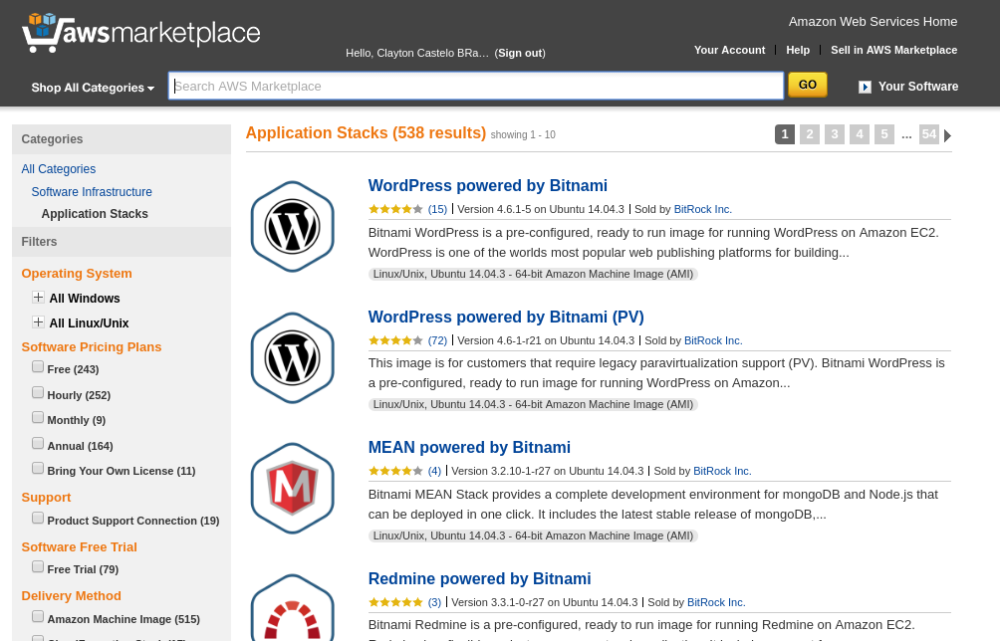
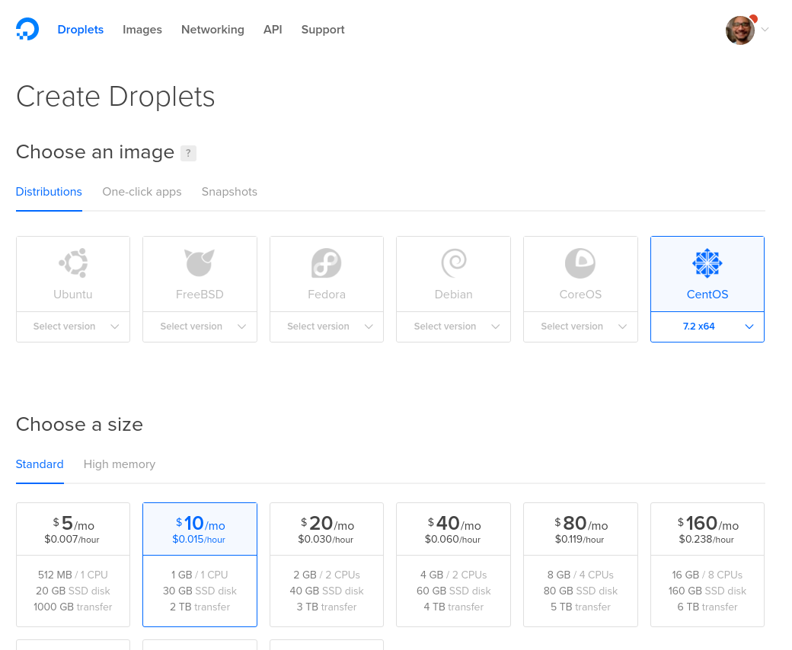
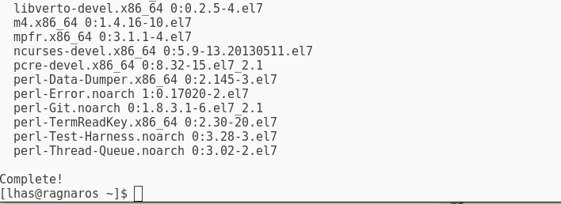
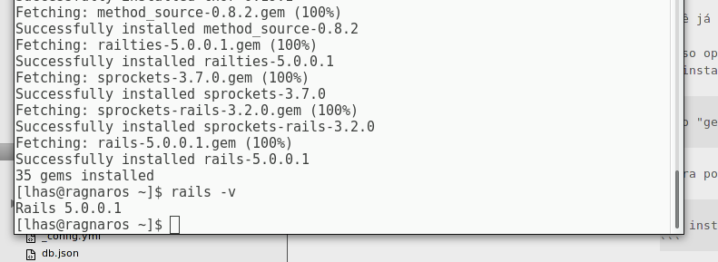
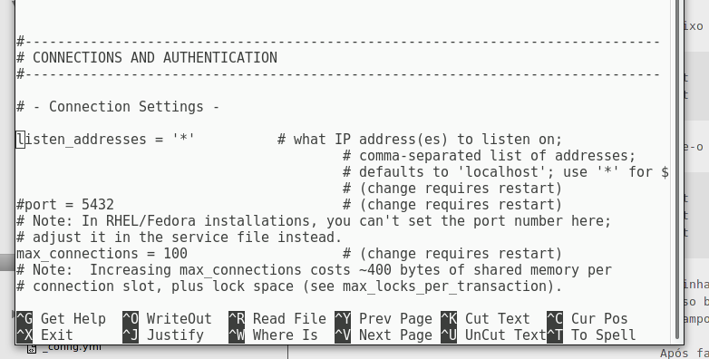
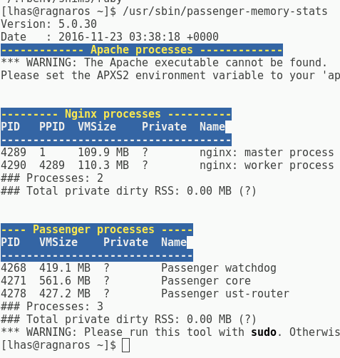

#  

Este é um processo que se faz necessário de vez em quando na vida de um desenvolvedor Ruby. Muitos dirão "ah usa Heroku", mas acredite jovem padawan, caminho melhor a seguir.

Este é o caminho mais sujeito a falhas, afinal, você ter o controle sobre tudo lhe permite que deixe falhas críticas na segurança. Mas é só você estudar um pouco e tomar bastante cuidado que a sua segurança não estará tão comprometida.

Eu resolvi escrever este post também para documentar passo-a-passo qual o procedimento que eu costumo fazer neste tipo de situação. Alguns amigos sempre me questionam como fazê-lo e esta será a forma mais prazerosa tanto para mim quanto para vocês de aprender.

Resumão do que faremos hoje:

- **Criando uma máquina virtual**
- **Instalando Rbenv**
- **Instalando Ruby**
- **Instalando Node.JS**
- **Instalando Rails**
- **Instalando PostgreSQL**
- **Instalando Nginx**
- **Instalando Passenger**
- **Considerações finais**

# Criando uma máquina virtual

Esta etapa é padrão independente do ambiente que você irá trabalhar, seja Amazon Web Services ou Digital Ocean, Linode, etc. O que muda é a forma como você estrutura seu servidor. Na AWS você tem 1 espécie de Marketplace com imagens Linux já pré-configuradas. Arrisco dizer que é a forma mais fácil (mas não necessariamente a melhor). Vale a sugestão para quem já está acostumado a fazer este processo e gostaria de automatizar um pouco mais.


*olha que delícia*

Hoje eu vou usar a [DigitalOcean](https://digitalocean.com).

As configurações serão:

- S.O CentOS 7.2 x64;
- Plano US$ 10 -> 1 GB, 1 CPU, 30 GB SSD, 2 TB transferência;
- Datacenter NYC 3;



## Por que CentOS?


Sou a favor de quebrar esta homogenidade que o Ubuntu criou no Linux. O Linux vai muito além do Ubuntu, tem muita coisa bacana para se usar. Eu digo isso pois durante muito tempo fui a favor desta ditadura Ubuntuniana.

Hoje eu uso Arch Linux na minha máquina pessoal e abstrai as possibilidades que vão além do `apt-get`. O `Pacman` com o `AUR` é superior a qualquer coisa que já vi nesta vida. Eu consigo instalar praticamente qualquer software relevante de hoje em dia só pelo terminal sem qualquer esforço. Slack, Skype, Sublime Text, VS Code. Qualquer coisa. Foda-se os .debs depois disso. :D

# Por que este plano de 10 dólares?

O ideal é que se tenha pelo menos 1 GB de memória para ambientes de produção. O plano inicial de 5 trumps só tem 512 mb e isso sempre estoura facilmente. Arrisco dizer que memória é o recurso mais "chato" (leia-se caro) de se trabalhar.

# Por que o NYC 3?


É o que tem a menor latência para o Brasil. É nesse ponto que com certeza a Amazon ganha para nós, brasileiros. Eles tem um datacenter em São Paulo e isso contribui muito para um bom desempenho das suas aplicações.

Aproveitei para adicionar a minha chave SSH na minha instância e sugiro fortemente que você faça o mesmo. [Caso não saiba o que é isso](https://www.digitalocean.com/community/tutorials/how-to-use-ssh-keys-with-digitalocean-droplets).

# Acessando nosso servidor

Agora que já criamos nossa instância e ela está rodando, basta rodar o comando abaixo para acessarmos nossa máquina via SSH:

`ssh root@IP.DA.MAQUINA`


Agora que já estamos dentro, a primeira coisa que devemos fazer é...

# Criar um novo usuário

É uma boa prática evitar usar o usuário **root**. Mas por enquanto vamos trabalhar com ele.

Para adicionar um novo usuário, rode:

`adduser lhas`

Eu coloquei *lhas* mas você deve colocar o *username* que lhe for conveniente.
Ele vem sem senha por padrão, vamos colocar uma senha:

`passwd lhas`

Agora você deverá digitar a nova senha e confirmar.


Vamos agora colocar ele como **super usuário**. Isto dará a ele as permissões de sudo (superusuário).

`gpasswd -a lhas wheel`

**wheel** é o nome do grupo que vamos adicionar o usuário. Este grupo, no CentOS, é um grupo que tem as permissões de **sudo**.

# Desabilitar acesso root

Segurança, lembra? Tão importante no mundo digital quanto no real.

Para isto vamos ter que editar o arquivo `/etc/ssh/sshd_config`.

Podemos usar o `vi` que vem por padrão.

Eu não gosto muito, prefiro o `nano`, acho bem mais intuitivo. Para quem não gosta do `vi`, sugestão:
`sudo yum install -y nano`

E agora podemos editar nosso arquivo:

`nano /etc/ssh/sshd_config`

Aperte `Ctrl+W` para pesquisar por uma string, digite *PermitRootLogin* e dê enter. Ele vai mudar o ponteiro diretamente para a linha. Descomente ela, e mude para `no`.

```
PermitRootLogin no
```

`Ctrl+X` para sair, `Y` para confirmar, enter para confirmar o overwrite e FOI!

Reinicie o serviço de SSH (opcional porém interessante fazê-lo):

`systemctl reload sshd`

Agora, podemos sair do usuário root, e finalmente logarmos com nosso novo usuário.

`exit`
`ssh lhas@ip.aqui`


Próximo passo...

# Instalando Ruby

Para esta tarefa, vamos usar o **Rbenv**.

Antes de instalarmos o *Rbenv*, vamos precisar instalar alguns compiladores na nossa máquina.

Isso pode soar estranho se você for um novato nesta área, mas acredite, é normal. No Ubuntu temos um facilitador que é o pacote `build-essentials`, para quem conhece. Aqui é basicamente o mesmo pacote só que sem estar compacto.

Copie a sopa de letrinhas a seguir:

```
sudo yum install -y git-core zlib zlib-devel gcc-c++ patch readline readline-devel libyaml-devel libffi-devel openssl-devel make bzip2 autoconf automake libtool bison curl sqlite-devel
```



Se você ver algo parecido com isto, deu tudo certo.

# Instalando Rbenv

Mais uma sopa de letrinhas explicada em comentários:

```
# Vai para a pasta do nosso usuário
cd ~/

# Clona o rbenv em uma pasta .rbenv
git clone git://github.com/sstephenson/rbenv.git .rbenv

# Adiciona o executável do rbenv na nossa variável PATH
echo 'export PATH="$HOME/.rbenv/bin:$PATH"' >> ~/.bash_profile
echo 'eval "$(rbenv init -)"' >> ~/.bash_profile
exec $SHELL

# Aqui ele vai instalar as dependencias necessárias para compilar o Ruby
git clone git://github.com/sstephenson/ruby-build.git ~/.rbenv/plugins/ruby-build
echo 'export PATH="$HOME/.rbenv/plugins/ruby-build/bin:$PATH"' >> ~/.bash_profile
exec $SHELL
```

Após rodar estes comandos, nós teremos o executável `rbenv` disponível para nosso usuário. Caso você não consiga executar o comando rbenv, experimente fazer logout e acessar de novo. Costuma resolver, pois ele recarrega os perfis de terminal.

# Instalando (de fato) o Ruby

A versão atual na escrita deste post do Ruby é 2.3.1.

Então para instalá-la, vamos rodar:

```
# Vai instalar a versão que nós desejamos
rbenv install -v 2.3.1

# Vai definir ela como versão global da nossa máquina
rbenv global 2.3.1
```

Vai tomar um café que esse momento é lerdo pra cacete mesmo.

Ele vai compilar a porra toda e isso é um processo demorado.

O resultado deverá ser o seguinte:


Você já pode rodar `ruby -v` para confirmar que está funcionando.

Passo opcional: caso você não queira que o RubyGems fique gerando documentação na instalação de cada gem, rode o seguinte comando para que isto não ocorra:

```
echo "gem: --no-document" > ~/.gemrc
```

Agora podemos instalar o **Bundler**:

```
gem install bundler
```

Agora, devemos remover o Ruby velho que tem na sua máquina provavelmente, e forçar o binário do Ruby instalado pelo Rbenv. Para isto, rode:

```bash
# Remove o binário antigo
sudo rm -rf /usr/bin/ruby

# Descobre o caminho do binário atual - copie o retorno deste comando (para mim foi /home/lhas/.rbenv/versions/2.3.1/bin/ruby)
rbenv which ruby

# Isto criará um symlink (atalho de binário) entre o Ruby do rbenv e a pasta de binários da máquina
sudo ln -s /home/lhas/.rbenv/versions/2.3.1/bin/ruby /usr/bin/ruby
```

# Instalando o Rails

Esta é a etapa mais fácil. Como vamos instalar a versão mais recente, isto basta;

```
gem install rails
```

Caso após este comando você não consiga rodar o Rails, experimente rodar isto aqui:

```
rbenv rehash
```

Ele recarrega todos os executáveis reconhecidos pelo Ruby.

Agora podemos confirmar que o Rails está instalado com `rails -v`.



# Instalando o Node.JS

Esta etapa pode ser necessária para rodar o Asset Pipeline disponível no Rails.

Como este não é o foco do tutorial, eu vou colocar os comandos necessários para instalar o [nvm](https://github.com/creationix/nvm) e a versão mais estável.

```
# Instalar nvm
curl -o- https://raw.githubusercontent.com/creationix/nvm/v0.32.1/install.sh | bash

# Rode isto para poder enxergar o binário do nvm nesta sessão (se não só fazer logout e logar de novo)
export NVM_DIR="$HOME/.nvm" [ -s "$NVM_DIR/nvm.sh" ] && \. "$NVM_DIR/nvm.sh"

# Instala a versão mais estável
nvm install node --default
```

O resultado será este:


Próximo passo...

# Instalando Postgres

Aqui poderia ser o MySQL por exemplo. Mas é uma convenção na comunidade rubista utilizar o PostgreSQL para tudo ao invés do MySQL.

Para instalar o Postgres, basta rodar:

```bash
sudo yum install -y postgresql-server postgresql-contrib
```

É importante instalar 2 pacotes que permitirão que nós instalemos nossa gem `pg`:

```bash
sudo yum install -y postgresql-libs postgresql-devel
```

Agora vamos inicializar a configuração padrão dele:

```
sudo postgresql-setup initdb
```

# Configurando o Postgres

Por padrão, o Postgres não permite autenticação com senha. Vamos mudar esta configuração editando um arquivo chamado HBA (Host-based Authentication):

```
sudo nano /var/lib/pgsql/data/pg_hba.conf
```

Pesquise pela linha "# IPv4 local connections:".

Abaixo dela, você verá algo assim:

```
host    all             all             127.0.0.1/32            ident
host    all             all             ::1/128                 ident
```

Mude-o para o seguinte:

```
host    all             all             127.0.0.1/32            md5
host    all             all             0.0.0.0/0               md5
host    all             all             ::1/128                 md5
```

A linha extra, do meio, é para permitir que possamos fazer acesso remoto no nosso banco de dados. A mudança de ident para md5 é necessária para ele levar o campo de senha em consideração na autenticação.


## Criando nosso usuário para acessar o banco

Acesse com o usuário postgres para poder rodar comandos no ambiente dele:

```
sudo -i -u postgres
```

Agora vamos rodar o comando para criar o usuário:

```
createuser --interactive
```

Ele vai pedir o nome, e depois se deve ser um superusuário. Confirme para superusuário com "y".

É um padrão do Postgres pesquisar por uma base de dados com o mesmo nome do usuário a logar. Mesmo que esta base de dados fique vazia, é apenas um comportamento padrão dele. Para evitar futuros problemas, podemos criar uma base para nosso usuário:

```
createdb lhas
```

Agora, podemos sair do usuário postgres e voltar para nosso usuário `lhas`:

```
exit
```

Após fazer isto, precisamos fazer mais 2 etapas:

a) Permitir o Postgres que IPs remotos o acessem;
b) Alterar a senha do usuário (role) que nós criamos.

## Permitindo o Postgres que IPs remotos o acessem

Acesse com o usuário postgres para poder editar os arquivos dele:

```
sudo -i -u postgres
```

Agora, edite o arquivo de configuração dele:

```
nano /var/lib/pgsql/data/postgresql.conf
```

Aperte Ctrl+W, pesquise por "listen_addresses". Descomente esta linha, e modifique de *"localhost"* para *"*"". Ficando assim:



Aperte Ctrl+X para sair, Y, enter.

Próximo passo...

## Alterando a senha do usuário (role) que nós criamos

Isto é muito simples. Nosso usuário já tem permissão para acessar o postgres, o problema é caso tentemos acessar remotamente, pois ele pedirá a senha, e nós não definimos nenhuma.

Para isto, saia do usuário postgres com `exit`.

Voltando para nosso usuário `lhas` (no meu caso), vamos acessar o **Console** do Postgres:

```
psql
```

Agora basta rodar este comando SQL para mudar a senha:

```
ALTER USER lhas PASSWORD 'nova_senha_aqui';
```

Pronto, isto basta.

## Acessando nosso banco de dados

Se você usar um programa como [DBeaver](http://dbeaver.jkiss.org/), você já poderá acessar o nosso banco usando o nosso IP como Host, o usuário que nós criamos, e a senha que criamos acima.


# Iniciando Postgres

Rode os seguintes comandos:

```
# Inicializa o serviço do Postgres que está desligado por padrão
sudo systemctl start postgresql
# Habilita o serviço do postgres ao ligar a máquina
sudo systemctl enable postgresql
```

Próximo passo...

# Instalando Passenger e Nginx


Primeiro passo é habilitar o [EPEL](https://fedoraproject.org/wiki/EPEL). Para isto:

```
sudo yum install -y epel-release yum-utils
sudo yum-config-manager --enable epel
```

Agora vamos instalar o **Passenger** junto com o **Nginx** em si:

```
# Adicionando repositório do Passenger
sudo curl --fail -sSLo /etc/yum.repos.d/passenger.repo https://oss-binaries.phusionpassenger.com/yum/definitions/el-passenger.repo

# Instalando o Passenger e Nginx
sudo yum install -y passenger nginx
```

**Observação importante**: Caso você já tenha o Nginx instalado, você tem que desinstalá-lo completamente com `sudo yum remove -y nginx*` antes de instalar o Passenger e o Nginx juntos.

Isto é necessário pois o Nginx que vem do repositório do Passenger é diferente do Nginx que vem do repositório oficial do CentOS. Esta diferença inclui os módulos necessários para o Passenger funcionar. Caso ele insista em instalar o Nginx do CentOS, dê uma olhada no [Yum Priorities](http://dev.antoinesolutions.com/yum-priorities).

Agora, se abrirmos no nosso browser `http://nosso.ip.aqui/`, poderemos ver uma tela semelhante a esta:


Após instalar o Nginx, vamos rodar 2 comandos:

```
# Inicializa o serviço do nginx
sudo systemctl start nginx

# Configura ele para ser bootável
sudo systemctl enable nginx
```

# Configurando o Nginx e Passenger

Esta é uma etapa necessária para indicarmos ao Passenger qual binário do Ruby usar e quais configurações ele deve trabalhar também.

Para isto, precisamos saber onde está o arquivo de configuração do Passenger. Basta rodar:

`passenger-config --root`

Ele vai retornar um caminho. Aqui para mim foi:

`/usr/share/ruby/vendor_ruby/phusion_passenger/locations.ini`

Anote este caminho. Ele será nosso **passenger_root**. Agora, vamos descobrir onde está o nosso binário do Ruby:

`rbenv which ruby`

Para mim retornou: `/home/lhas/.rbenv/versions/2.3.1/bin/ruby`

Anote este caminho também. Ele será nosso **passenger_ruby**.

Agora vamos editar o arquivo que o Passenger incluiu na nossa configuração do Nginx:

```
sudo nano /etc/nginx/conf.d/passenger.conf
```

Você verá um conteúdo semelhante a este:

```
#passenger_root /usr/share/ruby/vendor_ruby/phusion_passenger/locations.ini;
#passenger_ruby /usr/bin/ruby;
#passenger_instance_registry_dir /var/run/passenger-instreg;
```

Vamos descomentar estas 3 linhas, e mudar o **passenger_root** e o **passenger_ruby** para os caminhos que nós anotamos ali em cima:

```
passenger_root /usr/share/ruby/vendor_ruby/phusion_passenger/locations.ini;
passenger_ruby ~/.rbenv/shims/ruby;
passenger_instance_registry_dir /var/run/passenger-instreg;
```

Após finalizar estas alterações, salve e feche o arquivo.

Agora vamos reiniciar o Nginx e conferir se está tudo:

```bash
sudo systemctl stop nginx
sudo systemctl start nginx

# Validando instalação do Passenger
/usr/bin/passenger-config validate-install
```

Se rodarmos o comando a seguir, deveremos visualizar alguns processos tanto na aba de Nginx quanto do Passenger. Caso você não veja nenhum processo, algo na sua instalação deu errado:

```bash
/usr/sbin/passenger-memory-stats
```



Agora que já estamos com nossa *dobradinha* **Nginx** + **Passenger** instalado e configurado, vamos seguir para nossa aplicação de exemplo.

# Rodando uma aplicação


O primeiro passo aqui é clonar um projeto em Rails existente.

Eu tenho um, vou disponibilizar o caminho no código abaixo, vocês podem usá-lo de exemplo. Ele contém apenas 2 endpoints e alguns dados de seed, apenas para validar umas ideias.

É importante definirmos uma pasta que irá armazenar nossos projetos. Fica a gosto do freguês.

Eu vou usar a pasta `/home/lhas/apps` pois sou familiarizado com ela já. Outras pessoas usam `/var/www/apps` ou algo parecido.

## Clonando o projeto

```bash
# Cria nossa pasta que armazenará nossas aplicações em Rails
mkdir ~/apps
cd ~/apps

# Clona o projeto
git clone https://github.com/lhas/piratenstrasse-api.git
```

## Configurando o projeto

```bash
# Abra a pasta do projeto
cd piratenstrasse-api/

# Instale as dependências do projeto
bundle install
```

## Configurando database.yml e secrets.yml

```bash
# Edita a base de dados de exemplo
# Você deve levar o atributo "production" em consideração
nano config/database.yml

# Gera uma nova secret key - copie ela
bundle exec rake secret

# Edita o arquivo de secrets keys - cole aqui
# Você deve levar o atributo "production" em consideração
nano config/secrets.yml
```

## Rodando as migrações

```bash
# Cria a base de dados
RAILS_ENV=production bundle exec rake db:create

# Roda as migrações
RAILS_ENV=production bundle exec rake db:migrate

# Alimenta a base com os seeds
RAILS_ENV=production bundle exec rake db:seed
```

## Segurança em dados sensíveis

```
chmod 700 config db
chmod 600 config/database.yml config/secrets.yml
```

# Configurando permissões

Configurações necessárias para que o usuário e grupo `nginx` possa ler o conteúdo da pasta do app que pertence ao usuário e grupo `lhas`.

```
# Na pasta do app
sudo chmod g+x,o+x /home/lhas/apps/piratenstrasse-api

# Na pasta dos apps
sudo chmod g+x,o+x /home/lhas/apps

# Na pasta do usuário
sudo chmod g+x,o+x /home/lhas

# Na pasta de usuários
sudo chmod g+x,o+x /home/
```

## Testando se a app roda

```
RAILS_ENV=production rails s
```

Se você abrir no seu navegador [http://159.203.163.124:3000/students.json](http://159.203.163.124:3000/students.json), verão a nossa app rodando. Não se esqueça de substituir pelo IP da sua máquina, é claro! ;)

Se estiver funcionando corretamente, agora vamos fazer ela rodar através do Nginx.

## Rodando app através do Nginx

Vamos criar um arquivo de configuração para ele:

```bash
sudo nano /etc/nginx/conf.d/nome_do_app.conf
```

Agora coloque as seguintes informações neste arquivo:

```bash
server {
    listen 80;
    server_name ip.da.maquina.aqui;

    # Tell Nginx and Passenger where your app's 'public' directory is
    root /home/lhas/apps/piratenstrasse-api/public;

    # Turn on Passenger
    passenger_enabled on;
    # Você deve substituir o CAMINHO DO RUBY AQUI pelo caminho correto do binário do seu ruby através de "rbenv which ruby"
    passenger_ruby /home/lhas/.rbenv/versions/2.3.1/bin/ruby;
}
```

Salve o arquivo, saia dele.

Agora, vamos reiniciar o Nginx:

```
sudo systemctl stop nginx
sudo systemctl start nginx
```

Se tentarmos acessar nossa aplicação: [http://159.203.163.124/students.json](http://159.203.163.124/students.json)

Você deverá ver algo parecido com isto:


Se estiver visualizando isto (ou a sua aplicação) significa que deu tudo certo.

Parabéns! :-D

# Dúvidas?

Postem comentários com suas dúvidas e farei questão de ajudá-los a resolver problemas no processo deste tutorial.

# Problemas comuns

## Na primeira vez que abro minha aplicação rola um delay de alguns segundos. Isso é normal?

Sim, é normal. O Passenger está "ligando" a sua aplicação na primeira requisição, caso ele fique muito tempo ocioso ele hiberna novamente.

Você pode fazer com que ele fique sempre rodando através da diretiva [passenger_pre_start](https://www.phusionpassenger.com/library/config/nginx/reference/#passenger_pre_start).

## Apareceu um erro 500. Como posso ver o log?

**Nginx**

`/var/log/nginx/error.log`

**Aplicação**

`/home/lhas/apps/piratenstrasse-api/log/production.log`

## Como posso reiniciar minha aplicação?

Rode o comando abaixo:

```bash
passenger-config restart-app
```

Ele irá pedir para selecionar qual app deseja reiniciar:


Aperte enter e tudo se resolverá.

## Fiz modificações no meu app. Como subir?

O ideal para trabalhar profissionalmente com o processo de deploy é utilizar um automatizador para isto, como o [Capistrano](http://capistranorb.com/). Mas não irei abordar este assunto aqui para não fugir do tema.

Da forma que nós fizemos, o processo é bem simples de qualquer forma:

1) Envie as modificações para o seu repositório Git;

2) Acesse via SSH seu servidor;

```bash
ssh root@192.168.0.1
```

3) Abra a pasta do nosso projeto;

```bash
cd ~/apps/piratenstrasse-api/
```

4) Receba as modificações do repositório remoto;

```bash
git pull --force
```

5) Instale novas gems;
```bash
bundle install
```

6) Rode migrações;
```bash
RAILS_ENV=production bundle exec rake db:migrate
```

7) Reinicie o Passenger.
```bash
passenger-config restart-app
```

# Conclusão

Espero que este tutorial torne-se referência quanto a discussão repetitiva de novatos de qual é a melhor solução para subir nossas aplicações no dia-a-dia.

Muitos sugerem Heroku, mas existe vida depois do Heroku, acredite. E esta vida é mais divertida e econômica! :)
